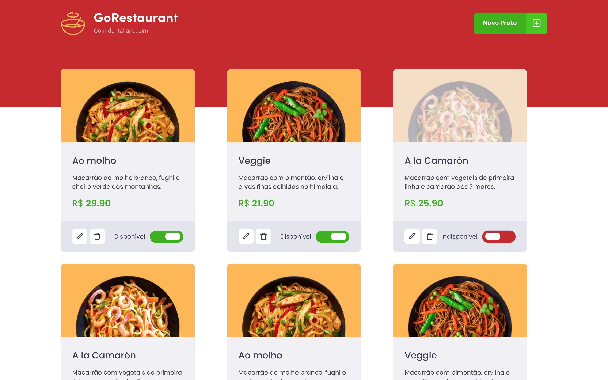

<h1 align="center">
    
      GoStack Bootcamp 
    ReactJS | React Native | NodeJS
</h1>

  

  

  

   

  

  

  

  <a href="#bookmark-about">About</a>&nbsp;&nbsp;&nbsp;|&nbsp;&nbsp;&nbsp;
  <a href="#rocket-dependencies">Dependencies</a>&nbsp;&nbsp;&nbsp;|&nbsp;&nbsp;&nbsp;
  <a href="#link-links">Challenge</a>

 

  

 

## :bookmark: About

ReactJS web application developed during the GoStack Bootcamp. Lists, adds, edits and deletes restaurant plates.

## :floppy_disk: Dependencies

-  [NodeJS](https://nodejs.org/en/) - v12.17.0
-  [ReactJS](https://reactjs.org/) - v16.13.1

## :link: Challenge

- [GoRestaurant - ReactJS](https://github.com/rocketseat-education/bootcamp-gostack-desafios/tree/master/desafio-reactjs-crud)
